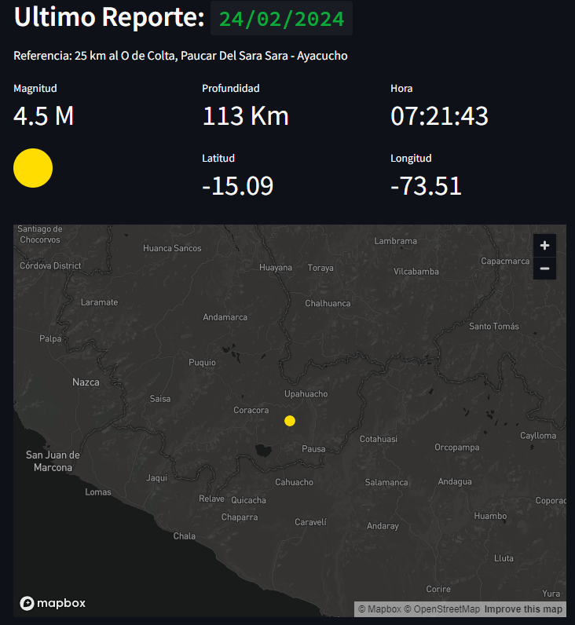
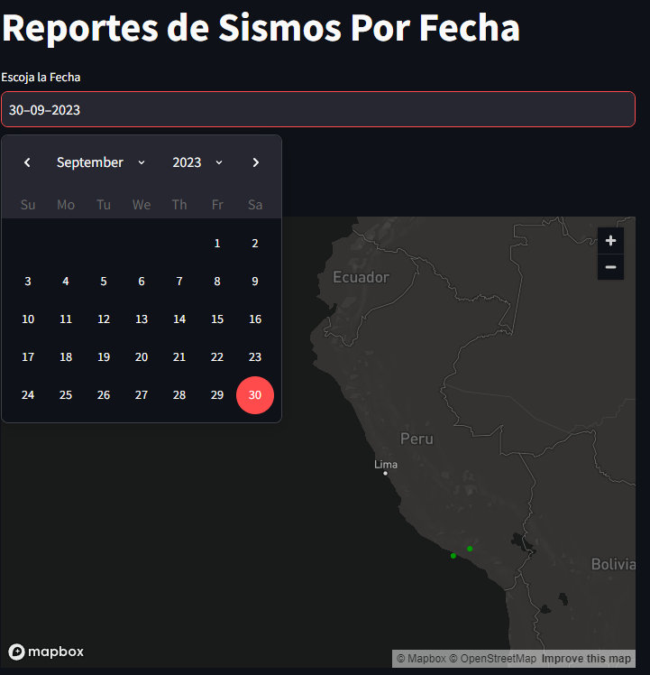
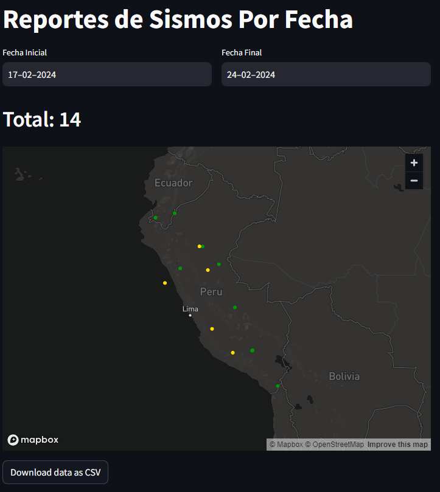
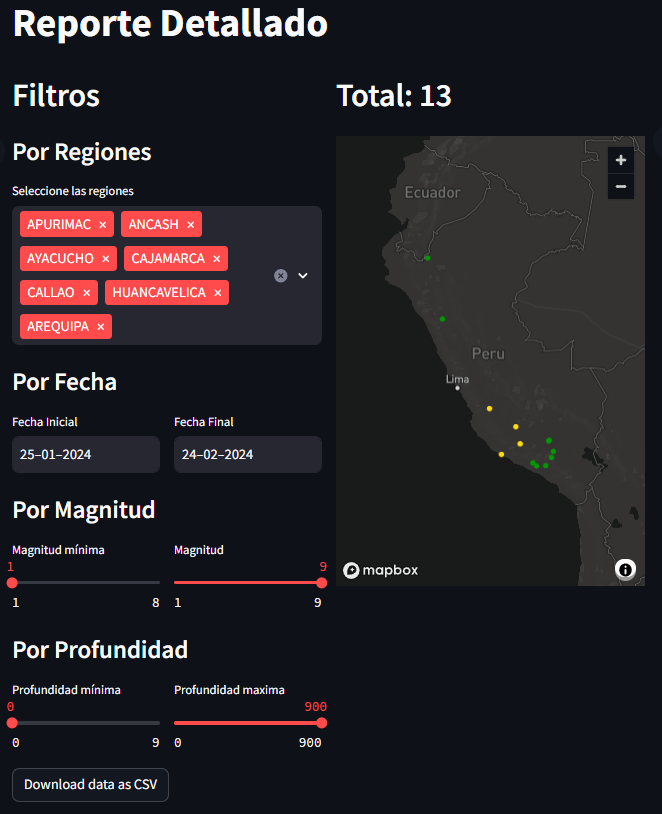

# IGP Clone App

## Overview

The IGP Sismo App is a web application that provides access to earthquake data obtained from the Instituto de Geofísica del Peru (IGP). It offers various features to explore earthquake information, visualize seismic events on maps, and download earthquake datasets.

## Features

- **Latest Earthquake**: Displays the most recent earthquake information similar to what is shown on the [IGP's last earthquake page](https://ultimosismo.igp.gob.pe/).

- **Date-specific Earthquake Map**: Shows a map of all earthquakes recorded on a specific date.

- **Date Range Filtering**: Allows users to filter earthquakes based on date ranges, view the earthquake map, and download datasets for the selected period.

- **Advanced Filtering**: Enables filtering earthquakes by magnitude, depth, location, in addition to date ranges. Users can visualize earthquake maps and download datasets as well.

## Usage

1. Visit the application's main page to view the latest earthquake information.
2. Navigate to the other pages using the sidebar to access additional features like date-specific earthquake maps, date range filtering, and advanced filtering.
3. Use the filtering options available on each page to customize earthquake data based on specific criteria.
4. Explore earthquake maps to visualize seismic events spatially.
5. Download earthquake datasets for further analysis.

## Disclaimer

The IGP Clone App is not affiliated with the Instituto de Geofísica del Peru (IGP) and was created for educational and informational purposes only. While efforts have been made to ensure the accuracy and reliability of the information provided, we do not guarantee its completeness or correctness. The use of this application is at your own risk, and we shall not be held responsible for any misuse, inaccuracies, or errors that may arise from its use.

## Feedback and Contributions

Feedback and contributions to improve this application are welcome. If you encounter any issues or have suggestions for enhancements, please feel free to [submit an issue](https://github.com/tjhon/IGP-clone/issues) or [create a pull request](https://github.com/tjhon/IGP-clone/pulls) on GitHub.

## License

This project is licensed under the [MIT License](https://opensource.org/licenses/MIT).

## ScreenShots
